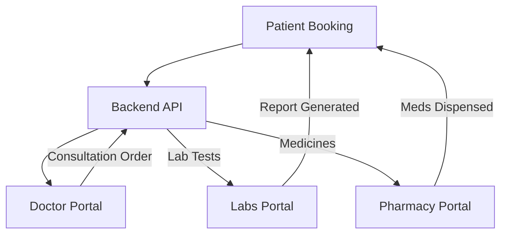

# HOSPITRA: Comprehensive System Report & Interview Guide

## 1. Project Essence
**HOSPITRA** is an end-to-end, multi-portal Hospital Management System (HMS) designed to streamline clinical workflows, financial operations, and patient engagement. Built using the **MERN** stack (MongoDB, Express, React, Node), it replaces manual paperwork with a synchronized digital ecosystem.

---

## 2. Technical Architecture
The system follows a **Monorepo-style** structure with a unified backend serving five distinct frontend applications.

- **Frontend**: React.js + Vite + Tailwind CSS (Responsive & Modern UI).
- **Backend**: Node.js + Express.js (RESTful API Design).
- **Database**: MongoDB (Flexible schema for medical records) with Mongoose ODM.
- **Real-time**: Socket.io for instant patient-doctor communication.
- **Media**: Cloudinary for storing patient profiles and lab images.
- **Communications**: Nodemailer for automated email notifications (appointments, invoices).

---

## 3. Panel-wise Deep Dive (The "Interviewer" View)

### A. Patient Portal (`/frontend`)
*The gateway for patients to access healthcare services.*
- **Smart Booking**: Implements a dynamic slot-finding algorithm that calculates availability across a 7-day window. It handles time-zone consistency and prevents double-booking at the database level.
- **Unified Health Records**: Patients can view and download Lab Reports and Pharmacy Invoices as PDFs. These are generated on-the-fly using `html2pdf.js`, ensuring a consistent "print-ready" format.
- **Tele-consultation Chat**: A real-time chat interface (Socket.io) allowing patients to share symptoms and files (images/PDFs) with their doctors.

### B. Doctor Portal (`/admin` - Doctor Role)
*The clinical engine of the system.*
- **Consultation Wizard**: A structured 3-step workflow (Diagnosis -> Lab/Pharmacy Orders -> Procedures). This ensures no clinical step is missed and automatically routes orders to the respective departments.
- **Integrated Patient History**: During chat or consultation, doctors have "One-Click" access to the patient's entire medical history, including past diagnoses and prescriptions.

### C. Reception Portal (`/reception`)
*The operational hub handling registrations and billing.*
- **Billing Initiation**: Bridges the gap between clinical orders and financial settlement. It pulls "Surgery" or "OPD" orders directly from the doctor's consultation state.
- **Lab Assignment**: Receptionists can convert a doctor's test recommendations into active lab samples, initiating the lab workflow.

### D. Labs Portal (`/labs`)
*The diagnostic processing center.*
- **Template-Driven Reporting**: To reduce manual entry errors, the system provides pre-configured templates for common tests (CBC, ECG, X-Ray, etc.) with standard parameters and normal ranges.
- **Report Lifecycle**: Tracks the sample from "Collected" to "Report Generated," notifying the patient immediately upon completion.

### E. Pharmacy Portal (`/pharmacy`)
*Inventory and medicine dispensing.*
- **Inventory Synchronization**: Every dispensed medicine automatically decrements the stock count in the MongoDB database, preventing "Out of Stock" dispensing.
- **Direct Order Processing**: Pharmacists see orders placed by doctors in real-time, reducing wait times for patients.

---

## 4. Cross-Module Data Flow

---

## 5. Potential Interview Questions (Q&A)

**Q: Why choose a multi-portal approach instead of a single app with roles?**
> **A:** Separation of concerns. Each portal is a dedicated Vite project. This reduces the bundle size for each role, enhances security by isolating routes at the build level, and allows independent scaling/deployment of different hospital departments.

**Q: How do you ensure data consistency when a doctor prescribes a medicine?**
> **A:** When a consultation is saved, the backend creates a structured `consultation` document. The pharmacy portal queries this ID to pre-fill the billing cart, ensuring the medicine name, dosage, and patient details match the doctor's exact intent.

**Q: Why use client-side PDF generation (`html2pdf.js`)?**
> **A:** It offloads the rendering heavy-lifting from the server to the client. Since the clinical data is already present in the React state, rendering it to a hidden DOM element and printing it is faster and more cost-effective for a high-traffic system.

---

## 6. Project Highlights for Your Interview
- **Real-time Synchronization**: Built a custom Socket.io middleware to handle "Doctor-Patient" pairing.
- **Audit Logging**: Implemented a backend middleware to track critical actions (like stock updates or billing) for accountability.
- **Professional Aesthetics**: Used Tailwind CSS with a "Hospitra-Blue" design system to give the app a premium, medical-grade feel.
